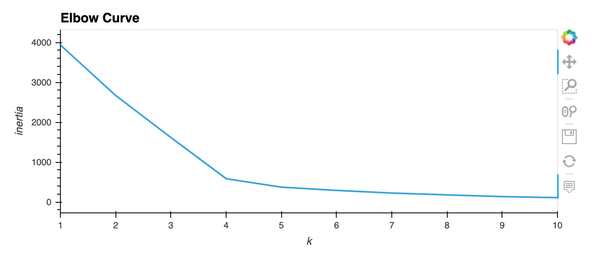
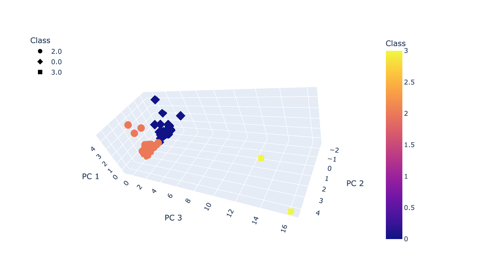

# Cryptocurrencies
Using unsupervised learning to discover trends in the cryptocurrencies to know which one to invest 

## Overview
The purpose of this project is to analyze cryptocurrency data, then create a report and a currency 
classification model to offer new types of investment to Accountability Accounting's clients. 
Unsupervised machine learning was used.

## Resources
- Data: crypto_data.csv
- Source: Jupyter Notebook, Pandas, SkLearning

## Summary

.
.
